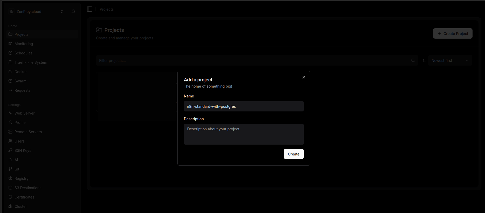
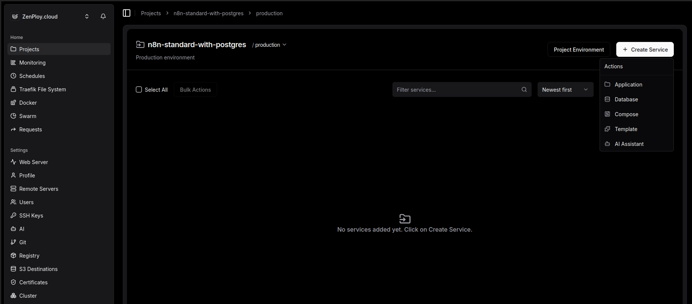
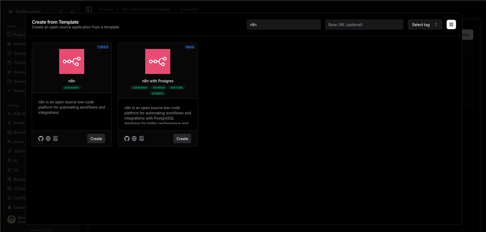
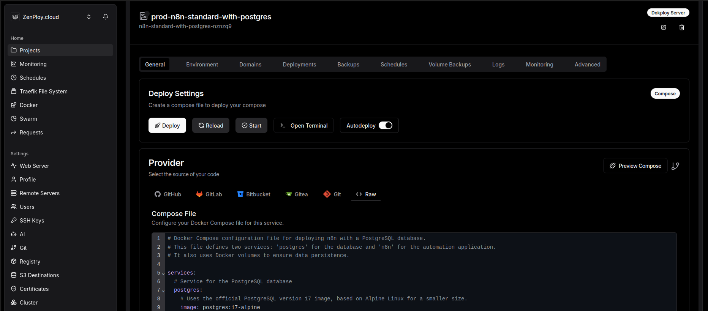
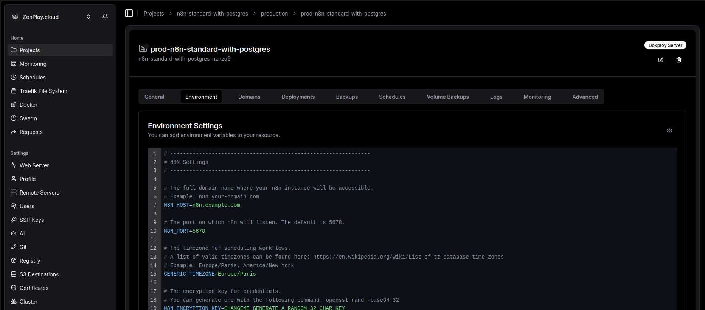
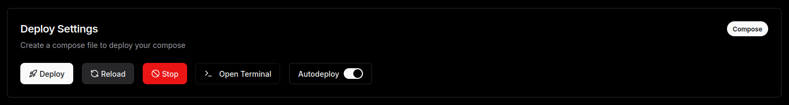
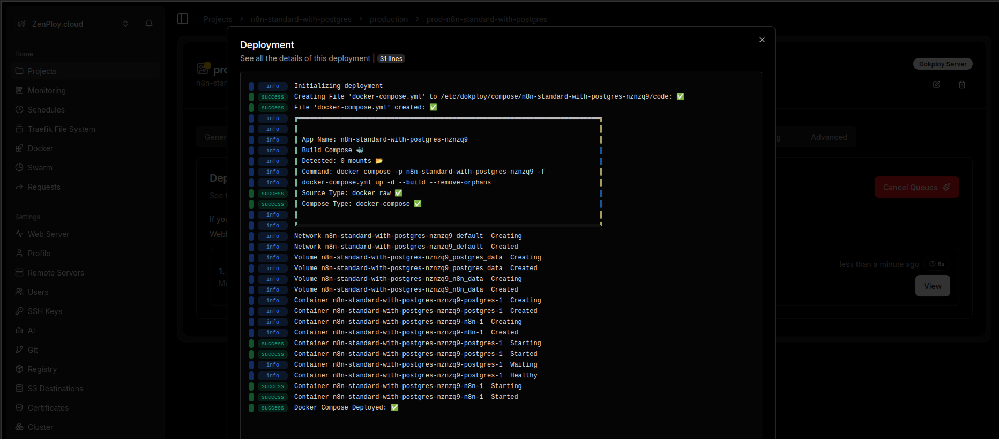
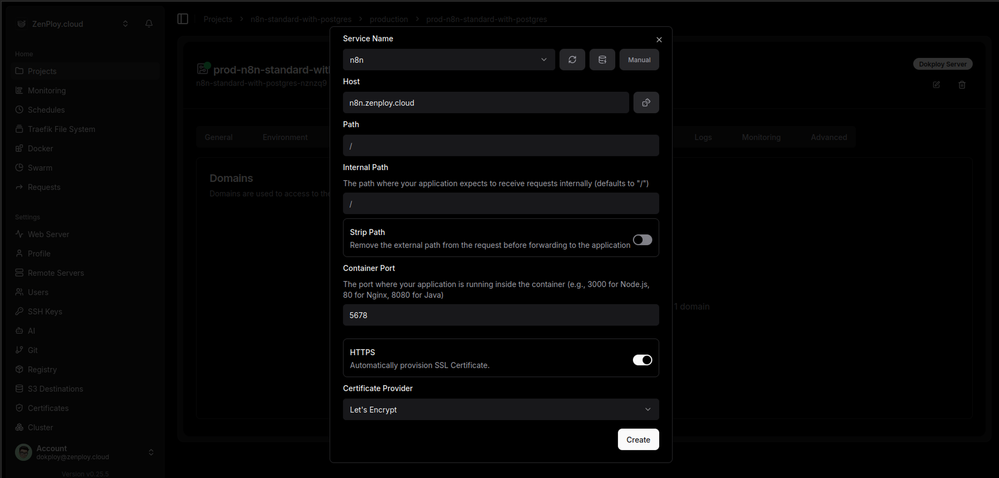
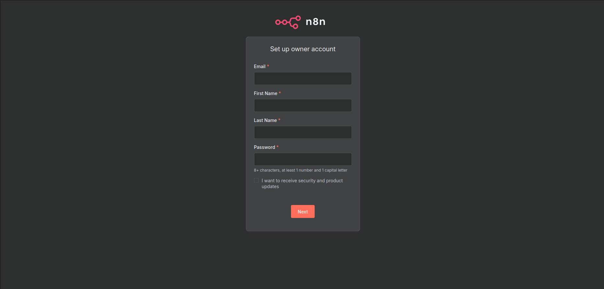

# n8n Production Stack for Dokploy

A production-ready Docker Compose configuration to self-host n8n automation platform with PostgreSQL. Designed for easy deployment using Dokploy.

## Features

- **PostgreSQL Database**: Reliable data persistence with PostgreSQL 17
- **Task Runners Enabled**: Isolated and secure workflow execution
- **Production Ready**: Optimized environment variables and security settings
- **Auto Cleanup**: Automatic pruning of old execution data (7 days retention)
- **HTTPS Ready**: Pre-configured for secure connections with reverse proxy support

## Quick Start with Dokploy

Follow these steps to deploy n8n on Dokploy:

### Step 1: Create a New Project

Start by creating a new project in Dokploy to organize your n8n deployment.



### Step 2: Create a New Service

Add a new service to your project. This will be your n8n instance.



### Step 3: Select n8n Template

Choose the n8n template from the available options to get started quickly.



### Step 4: Configure Docker Compose

Copy the contents of `n8n-standard-with-postgres/docker-compose.yml` from this repository and paste it into the Docker Compose configuration field.



### Step 5: Set Environment Variables

Configure the required environment variables. Use the template from `n8n-standard-with-postgres/dockploy-environment-settings.env`:

**Required Variables:**
- `N8N_HOST`: Your domain (e.g., n8n.yourdomain.com)
- `N8N_PORT`: Port number (default: 5678)
- `GENERIC_TIMEZONE`: Your timezone (e.g., Europe/Paris)
- `N8N_ENCRYPTION_KEY`: Generate with `openssl rand -base64 32`
- `POSTGRES_USER`: Database username (e.g., n8n)
- `POSTGRES_PASSWORD`: Generate with `openssl rand -base64 64`
- `POSTGRES_DB`: Database name (e.g., n8n)



### Step 6: Deploy the Application

Click the deploy button to start the initial deployment.



### Step 7: Check Deployment Details

Monitor the deployment logs to ensure everything is running correctly.



### Step 8: Configure Domain

Set up your domain name and SSL certificate for secure access.



### Step 9: Deploy Again

After configuring the domain, deploy again to apply the changes.


### Step 10: Set Up n8n Owner Account

Access your n8n instance at your configured domain and create the owner account.



## Configuration Details

### Docker Compose Structure

The setup includes two services:

- **postgres**: PostgreSQL 17 database with health checks
- **n8n**: n8n application (version 1.116.2) with task runners enabled

### Security Features

- Encrypted credentials with `N8N_ENCRYPTION_KEY`
- Secure cookies enabled
- Strict file permissions enforcement
- Git node bare repository protection
- Reverse proxy trust configuration

### Data Persistence

Two Docker volumes ensure data persistence:
- `postgres_data`: Database storage
- `n8n_data`: n8n workflows and credentials

### Automatic Cleanup

Execution data older than 7 days (168 hours) is automatically pruned to save storage space.

## Manual Deployment (Without Dokploy)

If you prefer to deploy without Dokploy:

1. Clone this repository:
   ```bash
   git clone https://github.com/your-username/n8n-docker-compose-dokploy.git
   cd n8n-docker-compose-dokploy/n8n-standard-with-postgres
   ```

2. Copy and configure the environment file:
   ```bash
   cp dockploy-environment-settings.env .env
   # Edit .env with your values
   ```

3. Deploy with Docker Compose:
   ```bash
   docker compose up -d
   ```

## Troubleshooting

### Check Logs
```bash
docker compose logs -f n8n
docker compose logs -f postgres
```

### Restart Services
```bash
docker compose restart
```

### Update n8n Version
Edit `docker-compose.yml` and change the image version, then:
```bash
docker compose pull
docker compose up -d
```

## Support

For issues and questions:
- [n8n Documentation](https://docs.n8n.io/)
- [n8n Community Forum](https://community.n8n.io/)
- [Dokploy Documentation](https://dokploy.com/docs)

## License

This configuration is provided as-is under the MIT License. n8n itself is licensed under the [Sustainable Use License](https://github.com/n8n-io/n8n/blob/master/LICENSE.md).
