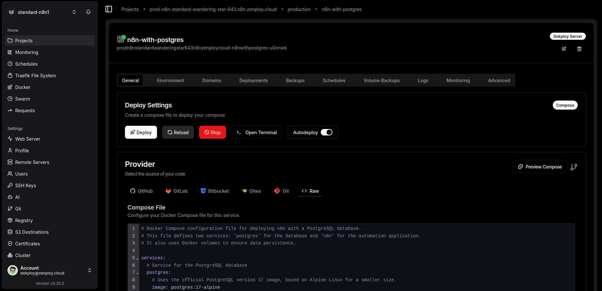
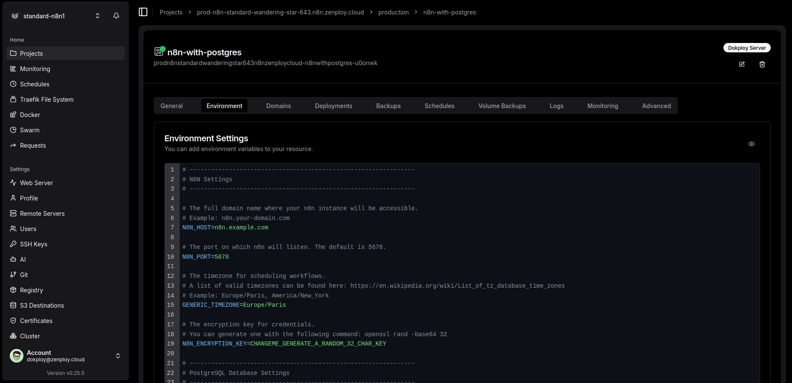
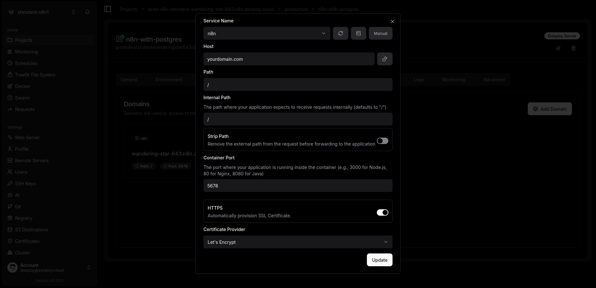
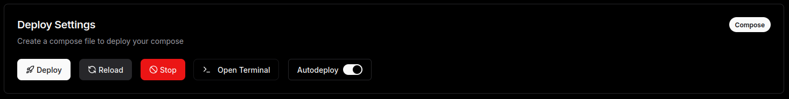

# n8n Production Stack for Docker & Dokploy

This repository provides production-ready Docker Compose configurations to self-host the n8n automation platform. It is designed for easy deployment using Dokploy or any standard Docker environment.

## Choose Your Deployment Mode

This repository offers two deployment modes. Choose the one that best fits your needs.

### 1. Standard Mode

A simple and efficient setup with a single n8n instance connected to a PostgreSQL database. Perfect for most use cases and easy to manage.









**[>> Go to Standard Mode instructions](./standard/)**

### 2. Queue Mode (Recommended for High Volume)

A scalable setup using Redis to manage a queue of executions, which are processed by dedicated worker services. This mode is ideal for high-volume workflows or to ensure the main n8n instance remains responsive.

**[>> Go to Queue Mode instructions](./queue/)**

## General Instructions

1.  Clone this repository:
    ```bash
    git clone https://github.com/your-username/your-repo-name.git
    cd your-repo-name
    ```
2.  Navigate to the chosen mode's directory (e.g., `cd standard`).
3.  Follow the instructions in the `README.md` file of that directory.

## Contributing
...
